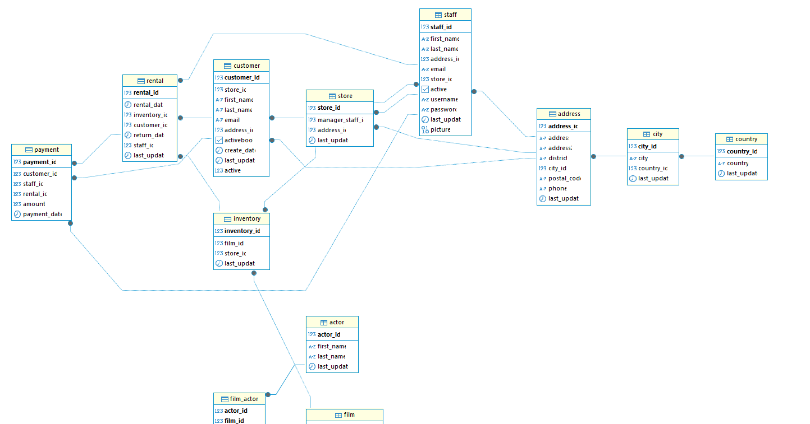

## sql В данном репозитории представлены 
- основные функции SQL-запросов
- агрегатные функции
- операция объединения таблиц
- оконные функции
- создание таблиц
## Скриншот ER-диаграммы из DBeaver`

